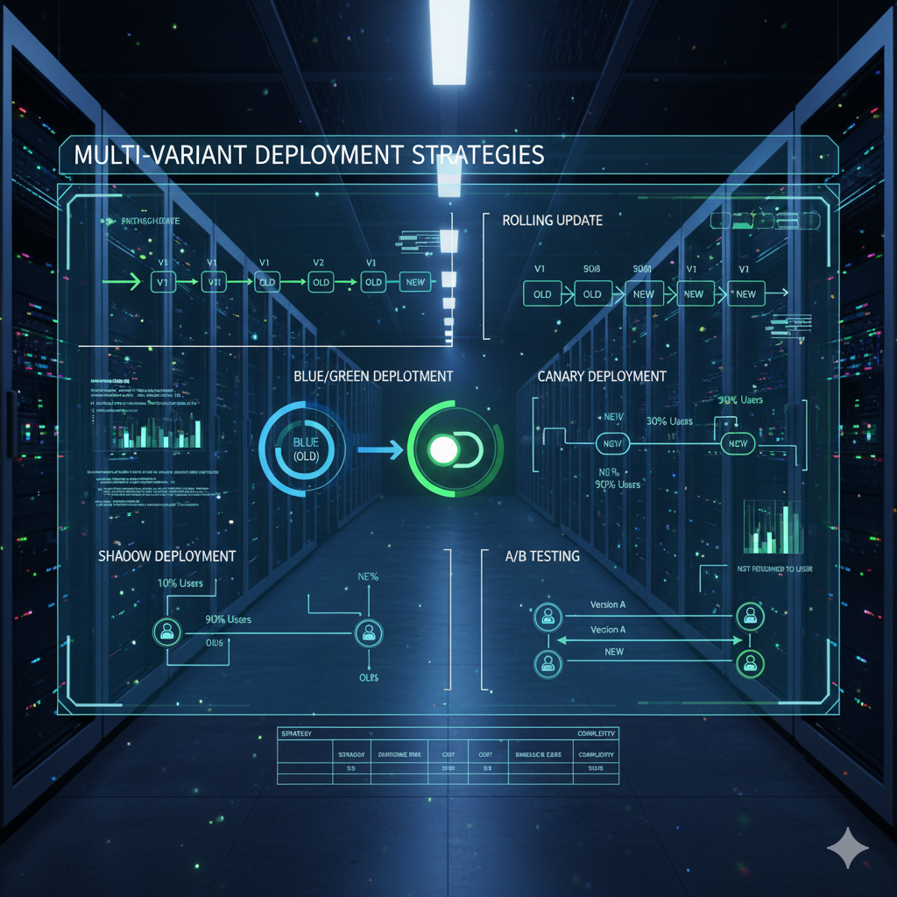

從第二個月開始，我開始逐漸熟悉使用 Terraform，開始嘗試規劃公司服務的網路並且開始了一些專案的部署。由於某些 Team 的專案需要使用大語言模型，因此我也了解到了一些建立 GPU 機器還有 Git LFS 大檔案的操作。

## 資安洩漏事件
在 9 月初的某一天，Team Lead 突然召集我們開了一個小會議，原因是客戶收到了一些其他公司的行銷訊息，不確定是不是我們的系統導致的資料外洩，但我們也需要去查明看看是否有資料外洩的管道，這也讓我了解到企業資安的重要性，然後在實戰中我也去追溯程式碼還有查看邏輯和可能的漏洞。

> **心得**：雖然不確定客戶的資料洩漏是否真的與系統有關，也有可能是他被社交攻擊，但也學習到了一些 JWT (JSON Web Tokens) 相關的內容。這邊也找到一個 [jwt.io](https://www.jwt.io/) 用於 Decode 和 Encode 的網站。

## 多方案部署策略

在部署專案的過程中，我也學習到了一些很重要的部署方式，但是否能夠根據專案需求調整部署策略也是身為專業的 DevOps 工程師應該要學會的技能。

### 部署策略的分類
1. 傳統部署(Recreate Deployment)
    >概念：停止舊版本 → 部署新版本
2. 滾動更新(Rolling Update)
    >概念：逐步用新版本替換舊版本，直到全部更新完成
3. 藍綠部署（Blue-Green Deployment）
    >概念：同時維護兩套環境：

    >Blue：目前上線版本
    >Green：準備上線的新版本
4. 金絲雀部署（Canary Deployment）
    >概念：先讓部分使用者使用新版本，再逐步擴大比例
5. A/B 測試（A/B Testing Deployment）
    >概念：同時部署多個版本給不同使用者群體。

    >A/B 測試 和 ALB 分配流量的表現形式很類似，但意義不同，如果想看看ALB流量分配，可以[點這裡](http://blue-green-canary-alb-873311364.us-west-2.elb.amazonaws.com)看Demo
6. 暗發佈（Shadow Deployment / Dark Launch）
    >概念：新版本接收真實流量，但結果不返回給使用者（僅觀察系統表現）

7. 滾回策略（Rollback Strategy）
    >概念：當新版本出現問題時，快速回復至上一穩定版本

8. Feature Toggle（功能開關部署）
    >概念：新功能代碼已上線，但透過開關控制是否啟用

### 部署策略總結比較

| 部署策略 | 停機風險 | 成本 | 回滾難易 | 實作複雜度 | 適用場景 |
|---------|---------|------|---------|-----------|---------|
| 傳統部署 | 高 | 低 | 中 | 低 | 小型內部系統 |
| 滾動更新 | 低 | 中 | 中 | 中 | 容器化平台 |
| 藍綠部署 | 低 | 高 | 低 | 中 | 零停機需求 |
| 金絲雀發布 | 低 | 中 | 低 | 高 | 大型線上服務 |
| A/B 測試 | 低 | 中 | 中 | 高 | 功能實驗 |
| 暗發佈 | 低 | 高 | 高 | 高 | 性能驗證 |
| 功能開關 | 低 | 低 | 低 | 中 | 持續交付 |

## 人資聊天與按摩服務

工作的任務介紹的差不多，大約在 9 月中，也就是我入職 1 個半月時，人資姊姊敲我說能不能聊聊，我記得那天約下午 15:15，然後最後我們大約聊到 16:50 左右，我直接聊完下班。內容大致上就是 OnBoard 這 1 個月以來是否還習慣，然後我也更了解目前公司的各 Team 組織架構，也聊了 Team Bonding 其他 Team 去哪裡玩，還有每季聚餐吃什麼，然後我也向她感謝了公司給了我一台新筆電，讓我覺得很開心。

每 2 個月我們可以預約按摩服務，會有視障按摩師來公司駐點，作為一個新鮮人就預約了一次嘗試看看。我預約了 9/26 那週的週五，給自己一個 Happy Weekend，當天我準時抵達哺乳室門口（對，我們公司按摩是在哺乳室中 XD），按摩時間大約 30 分鐘，面朝下趴在一個按摩床上。原來按摩師也算是我們公司的員工之一，但是她也可以去服務其他公司。了解到原來按摩證照是只有視障者才可以考取，普通人不能考取，這是一個政府的保護政策，不得不說我們的按摩師力道很夠，而且可以按摩到穴位，按摩後的 1～2 天我還是會覺得有點酸痛，這和之前的按摩體驗不太一樣。

## 總結
來公司 2 個月，我覺得挺開心的，每週的手搖杯已經喝到有點怕，開始帶回家給家人品嚐，上班體驗按摩服務還蠻有趣的，這應該不是所有公司都有提供。作為新鮮人上班可以離家很近，回家騎腳踏車也很快，這真是一個其他公司比不了的大福利。