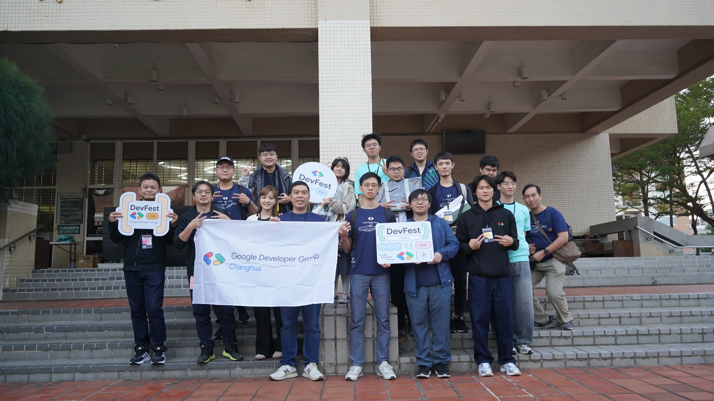

# DevFest 介紹 - Google 年會

每年的年底都是 DevFest 的舉辦高峰時期，在全台的 6 個縣市分別會舉辦一場大型的開發者年會，年會當天有精彩的議程以及眾多對 Google 技術有興趣的會眾一同參與。

在 2022 年開始，我第一次參與彰化 DevFest 是在火車站旁的書局地下室，那個場地大約可以容納 30 人，算是彰化 GDG 的首場 DevFest，讓人覺得非常溫馨，再加上彰化是一個和眾多大城市相比更有人情味的地方，我覺得在這裡參與活動的感覺就是小而美的世外桃源。

---

# DevFest Changhua 2025

今年的活動舉辦在彰化師範大學進德校區的圖資中心地下室演講廳，現場可以容納 120 人左右，這是歷屆最多的人數，而在活動的報到率也超過九成，這是非常高的比例。

彰化 DevFest 由於場地不像台北那麼大，反而能夠讓我在這裡認識了更多的夥伴，從 2022 開始每年都陸續認識很多朋友，例如 GDG 彰化組織者佳新、FKT、Bruce、楷言、橘子等，在活動的現場都能有非常多的交流與互動。

---

# 演講經歷 - 從校園教室走到演講廳百人觀眾

我的演講經歷從校園的 40 人逐漸成長到如今到破百人，我也依舊不會怯場，走出校園面對的是各式各樣的民眾，需要保留技術的同時，也要講解的淺顯易懂。

從去年 2024 開始我就開始嘗試練習在 DevFest 分享技術，去年在台北 DevFest 講的是[大語言模型的評估](https://docs.google.com/presentation/d/150t0ppvSmcPPfs7YnsXUXoqGm73F3trhX0uv1Ez1KXA/edit?slide=id.g2efaa4a1007_0_0#slide=id.g2efaa4a1007_0_0)，而今年我緊扣 Google 最新發表的 AI IDE，**Antigravity** 作為閃電秀的主軸，並且搭配 **規格驅動開發（SDD）** 的急速開發，讓台下百人觀眾得以知道這些技術該如何使用在自己的軟體開發流程。

## 演講主題：Antigravity 導入 SDD 的急速開發術

> **什麼是規格驅動開發（SDD）？**
> 
> 規格驅動開發（Specification-Driven Development, SDD）是一種軟體開發方法論，強調在開始編寫程式碼之前，先定義清楚、完整的規格說明。這種方法可以幫助開發團隊：
> - 減少需求理解錯誤
> - 提高開發效率
> - 降低後續維護成本
> - 改善團隊溝通

### Antigravity：Google 的 AI 程式編輯器

**Antigravity** 是 Google 最新推出的 AI 程式編輯器，它能夠：

- **程式碼生成**：根據規格自動生成程式碼
- **即時建議與修正**：提供即時的程式碼建議和錯誤修正
- **規格理解**：理解自然語言描述的規格，轉換為可執行的程式碼
- **快速迭代**：大幅縮短從規格到實作的時間

### 演講重點回顧

在這次的閃電秀中，我分享了：

- **SDD 的核心概念**：如何從規格開始，而不是從程式碼開始
- **Antigravity 的實際應用**：如何在 Antigravity 中使用 SDD 方法
- **實戰案例**：展示一個完整的開發流程，從規格到實作

> **演講簡報連結**：[Antigravity 導入 SDD 的急速開發術](https://hackmd.io/@120061203/HyvI1fbf-x)

---

# 活動收穫與反思

## 技術交流

在活動現場，我與許多開發者進行了深入的技術交流：

- **SDD 的實際應用場景**：許多開發者分享了他們在專案中使用類似方法的經驗
- **AI 工具的未來**：討論了 AI 程式編輯器對軟體開發產業的影響
- **開發流程優化**：交流了如何將新工具整合到現有工作流程中

## 社群連結

透過這次活動，我認識了更多志同道合的開發者，也加深了與 GDG 彰化社群成員的連結。這種小而美的社群氛圍，讓技術交流更加深入和真誠。

---

# 相關資源

-  [本次閃電秀演講簡報](https://hackmd.io/@120061203/HyvI1fbf-x)
- [2024 DevFest Taipei 演講：LLM Comparator](https://docs.google.com/presentation/d/150t0ppvSmcPPfs7YnsXUXoqGm73F3trhX0uv1Ez1KXA/edit?slide=id.g2efaa4a1007_0_0#slide=id.g2efaa4a1007_0_0)

---

*感謝 GDG 彰化團隊和所有參與的開發者，讓這次活動如此精彩！期待下次再見！*
