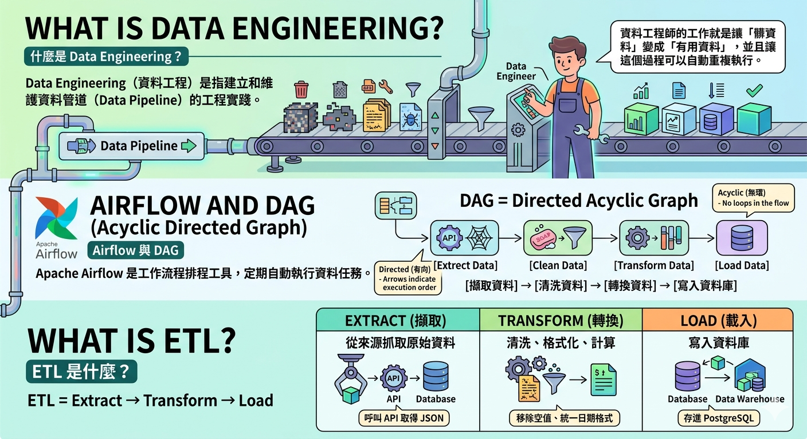

## 前言

在研究所在學期間，我和學校的夥伴會一起去參加黑客松競賽提升實力、接觸業界。但是我發現在工作後，很少有機會接觸外界，整天就是工作，下班後會很累（雖然我自己還是去進修不同課程啦）。而且我們公司有**台北、台中、新竹** Office，雖然我都在工作上和台北的工程師配合各種專案的維運，不過實際上在真實世界裡沒有遇過他們，公司裡的人都戲稱為「**網友**」。

在 **3 月的某一天**，我記得是報名截止日前一週左右，我問了台北的後端工程師（這裡簡稱 **R 工程師**），他說他也有興趣，後續他幫我邀請了**專案經理、前端工程師、AI 工程師**，就這樣我們 **5 個人**組成了一支隊伍前往參賽。

在賽前工作坊 **4/11** 當天，我前往台北。當天早上是**資訊局長趙式隆**介紹比賽規則，並且有城市儀表板開發團隊進行了比賽技術的介紹。刺激的事情來了——我們隊其實在事前雖然有討論一些主題，不過局長有提到**比賽主題將會在比賽當天才公布**，因此我們之前討論的東西都不能用。我看著其他隊伍拿著精美的簡報應對下午的選手面談，讓我覺得有一點點緊張和擔憂。

> 所幸我在事前有整理了很多大會官方的資源，並且完整部署過環境，因此我還是在工作坊當天提出了一些能夠在比賽當中實作的想法——運用類似 Spotify 的歌曲封面分享功能，讓城市儀表板能夠在普羅大眾之間去分享。


在工作坊結束後，我們**順利入選了**！在報告的時候我的電腦還因為插上 HDMI，結果 RAM 過載，突然當機，還好有隊友的電腦借來備用，有驚無險。


## 背景知識

如果你對黑客松有興趣，我這裡也提供官方的[報名頁面](https://codefest.taipei/2026-spring/)（不過今年春季已經截止了，可以期待秋季的）。我第一次參加是在 **2024 年**，當時懵懂無知，不過**每次的競賽都會讓自己某方面的技能提升一點**。例如這一次我提升比較多的是在 **Data Engineering** 的部分，因此接下來會著重介紹。

 ### 什麼是 Data Engineering？

Data Engineering（資料工程）是指**建立和維護資料管道（Data Pipeline）的工程實踐**，讓原始資料能被自動化地擷取、清洗、轉換，最終儲存成可供分析或展示的形式。

簡單來說：

> **資料工程師的工作就是讓「髒資料」變成「有用資料」，並且讓這個過程可以自動重複執行。**

### Airflow 與 DAG

**Apache Airflow** 是一個工作流程排程工具，讓你可以定期（例如每天、每小時）自動執行資料處理任務。

**DAG（Directed Acyclic Graph，有向無環圖）** 是 Airflow 的核心概念，代表一個完整的工作流程。

```
[擷取資料] → [清洗資料] → [轉換資料] → [寫入資料庫]
```

每個箭頭代表任務的執行順序，不能有循環（所以叫「無環」）。

### ETL 是什麼？

**ETL = Extract → Transform → Load**

| 步驟 | 說明 | 範例 |
|------|------|------|
| **Extract（擷取）** | 從來源抓取原始資料 | 呼叫 API 取得 JSON |
| **Transform（轉換）** | 清洗、格式化、計算 | 移除空值、統一日期格式 |
| **Load（載入）** | 寫入資料庫 | 存進 PostgreSQL |

 

## ETL 實作解析

這次比賽的核心是一支 **Python ETL 腳本**，共分**四個階段**：

> **下載原始資料 → 標準化 → 建構儀表板資料 → 寫入 PostgreSQL**

### 第一階段：下載原始資料

用 `urllib.request` 批次下載多個資料集，並支援**三種執行模式**：

```python
import urllib.request

def download_raw_files(mode="missing_only"):
    for key, dataset in TARGETS.items():
        for url in dataset["access_urls"]:
            dest = f"raw/{key}.csv"
            if mode == "skip":
                continue
            if mode == "missing_only" and os.path.exists(dest):
                continue
            urllib.request.urlretrieve(url, dest)
```

| 模式 | 行為 |
|------|------|
| 預設 | 只下載本地不存在的檔案 |
| `--refresh-raw` | 強制重新下載全部 |
| `--skip-download` | 跳過下載，直接用現有檔案 |

---

### 第二階段：標準化（Normalize）

每個資料集有對應的 `normalize_*()` 函數，統一透過**字典分派**：

```python
NORMALIZERS = {
    "dataset_a": normalize_a,
    "dataset_b": normalize_b,
    # ...
}

for key, rows in raw_data.items():
    normalized[key] = NORMALIZERS[key](rows)
```

三個常用的**輔助轉換函數**：

**民國日期 → 西元**

```python
def parse_date(raw: str) -> str:
    # "1120104" → "2023-01-04"
    if len(raw) == 7:
        year = int(raw[:3]) + 1911
        return f"{year}-{raw[3:5]}-{raw[5:7]}"
```

**拆分店名與地址**

```python
def split_place(text: str) -> tuple[str, str]:
    # "廣誠素食臺北市松山區..." → ("廣誠素食", "臺北市松山區...")
    match = re.search(r"(台|臺|新北|基隆)", text)
    idx = match.start() if match else len(text)
    return text[:idx], text[idx:]
```

**郵遞區號 → 行政區**

```python
def district_from_code(code: str) -> str:
    # 取後 4 碼對照區域表
    return DISTRICT_MAP.get(code[-4:], "未知")
```

產出：`normalized/{key}.json`

---

### 第三階段：建構儀表板資料

每個儀表板對應一個 `build_*()` 函數，**輸入**標準化資料，**輸出**聚合統計：

```python
def build_inspection_dashboard(data: list[dict]) -> dict:
    return {
        "summary": {"total": len(data)},
        "by_year": group_by(data, "year"),
        "by_district": group_by(data, "district"),
        "latest_records": data[:500],
    }

def build_risk_dashboard(datasets: dict) -> list[dict]:
    for district in districts:
        failure_index = failures[district] / max_failures * 75
        risk_score = min(100, failure_index + grade_gap_index)
    return sorted(results, key=lambda x: -x["risk_score"])
```

---

### 第四階段：寫入 PostgreSQL

透過 `docker exec` 對**容器內**的 PostgreSQL 執行 SQL，不需在宿主機安裝 psql：

```python
def run_sql(container: str, db: str, sql: str):
    subprocess.run(
        ["docker", "exec", "-i", container, "psql", "-U", "postgres", "-d", db],
        input=sql.encode(),
        check=True,
    )

def load_to_db():
    # 1. 建立 schema
    run_sql("postgres-data", "dashboard", open("schema.sql").read())

    # 2. 批次 INSERT 標準化資料
    for table, rows in normalized.items():
        insert_rows(table, rows)

    # 3. 註冊儀表板組件
    run_sql("postgres-manager", "dashboardmanager", open("components.sql").read())
```

---

## SQL 設計

ETL 腳本呼叫**兩支 SQL 檔案**，分別寫入不同的資料庫容器：

| 檔案 | 目標容器 | 用途 |
|------|----------|------|
| `food_safety_tables.sql` | `postgres-data` | 建表、寫入資料 |
| `food_safety_components.sql` | `postgres-manager` | 註冊儀表板組件 |

### food_safety_tables.sql（schema + 靜態資料）

**建表**：每張表以 `CREATE TABLE IF NOT EXISTS` 建立，並在後面立刻 `TRUNCATE` 清空，確保**每次 ETL 重跑都是乾淨的**：

```sql
CREATE TABLE IF NOT EXISTS food_inspection_failures (
    id          SERIAL PRIMARY KEY,
    district    TEXT,
    sample_date DATE,
    year        INTEGER,
    item        TEXT,
    result      TEXT
);
TRUNCATE food_inspection_failures;
```

複雜的巢狀結構（如多種違規原因計數）用 **`JSONB`** 欄位存：

```sql
reason_counts JSONB  -- {"標示不符": 12, "添加物超標": 5, ...}
```

**相容舊 schema**：若表已存在但缺少新欄位，用 `ADD COLUMN IF NOT EXISTS` 補充，不需整張表重建：

```sql
ALTER TABLE district_food_risk ADD COLUMN IF NOT EXISTS city TEXT;
```

**靜態資料**：ETL 無法自動抓取的資料直接 `INSERT` 寫死，再用 `UPDATE` 補齊關聯欄位：

```sql
INSERT INTO market_quality_awards (city, year, market_name, grade) VALUES
('taipei', 2020, '士東市場', 5),
('taipei', 2020, '南門市場', 5);

-- 來源沒有 district，手動 UPDATE 補上
UPDATE market_quality_awards SET district = '士林區' WHERE market_name = '士東市場';
```

**清理舊表**：版本迭代後廢棄的表用 `DROP TABLE IF EXISTS` 移除：

```sql
DROP TABLE IF EXISTS food_inspection_trend;
DROP TABLE IF EXISTS food_inspection_by_district;
```

---

### food_safety_components.sql（儀表板註冊）

這支 SQL 寫入另一個容器（`postgres-manager`），負責告訴儀表板系統**「有哪些組件、要查什麼資料、怎麼顯示」**。

> 每次重跑前先清舊資料，避免重複插入造成資料錯亂。

```sql
DELETE FROM dashboard_groups
WHERE dashboard_id IN (SELECT id FROM dashboards WHERE index IN ('food_safety_taipei', ...));

DELETE FROM dashboards WHERE index IN ('food_safety_taipei', ...);
```

**組件查詢 SQL 的幾個常見模式：**

**1. 分類彙整**（`CASE WHEN` 將細項歸大類）：

```sql
SELECT
    CASE
        WHEN item ~ '青江菜|菠菜|小白菜' THEN '葉菜類'
        WHEN item ~ '芫荽|青蔥|香菜'     THEN '香辛植物'
        ELSE '其他'
    END AS category,
    COUNT(*) AS total
FROM food_inspection_failures
GROUP BY category;
```

**2. 跨城市 UNION**（合併台北＋新北資料）：

```sql
WITH taipei AS (
    SELECT x_axis, data FROM district_food_risk
),
ntpc_normalized AS (
    SELECT district AS x_axis, ROUND(total / max_val * 100) AS data
    FROM ntpc_aggregated
)
SELECT * FROM taipei
UNION ALL
SELECT * FROM ntpc_normalized
ORDER BY data DESC;
```

**3. 時間軸查詢**（年份轉時間戳）：

```sql
SELECT
    make_timestamptz(year, 7, 1, 0, 0, 0, 'UTC') AS x_axis,
    food_poisoning_people::float AS data
FROM food_hygiene_work
ORDER BY year DESC LIMIT 12;
```

**4. 建立儀表板**，用 `ON CONFLICT DO UPDATE` 讓重複執行**安全冪等**：

```sql
INSERT INTO dashboards (index, name, icon)
VALUES ('food_safety_metrotaipei', '食安守護', 'restaurant')
ON CONFLICT (index) DO UPDATE SET name = EXCLUDED.name;
```

---

### 小結

整個 ETL 的設計重點：

| 設計 | 效果 |
|------|------|
| **字典分派**取代 if/else | 新增資料集只需加一行 |
| **輔助函數**集中轉換 | 統一處理日期、地址、區域代碼差異 |
| **CLI 執行模式** | 開發與正式環境共用同一支腳本 |
| **docker exec** | DB 操作不需在宿主機安裝 psql |
| **TRUNCATE + 重跑** | 保證資料冪等性 |

> `ON CONFLICT DO UPDATE` 讓 SQL 註冊也是冪等的，重跑不怕重複。

---

## GitHub

- 我的參賽分支：[120061203/Taipei-City-Dashboard (billy-base)](https://github.com/120061203/Taipei-City-Dashboard/tree/billy-base)
- 官方儀表板：[taipei-doit/Taipei-City-Dashboard](https://github.com/taipei-doit/Taipei-City-Dashboard)

---

## 資料來源

### 食物中毒趨勢
- 台北市：[食品衛生業務工作概況](https://data.taipei/dataset/detail?id=7d50657f-b35b-496e-b83f-5713893b9a9e)

### 餐飲衛生分級
- 台北市：[餐飲衛生安全分級評核](https://data.taipei/dataset/detail?id=59579c19-a561-4564-8c0f-545bfb32c0f6)、[傳統市場衛生品質評核](https://data.taipei/dataset/detail?id=bb665f7f-085c-40f9-9b9a-844e46da9c65)
- 新北市：[餐飲衛生安全分級評核](https://data.ntpc.gov.tw/datasets/8e64b205-a100-4a9a-bd76-8e362761fd61)

### 食品抽檢不合格
- 台北市：[食品抽驗不合格資料](https://data.taipei/dataset/detail?id=09a917a0-0fb5-47e1-957c-5f1268fba517)
- 新北市：[食品抽驗不合格資料](https://data.ntpc.gov.tw/datasets/078cb722-15ac-4e1e-b541-e75bfe0aa440)

### 行政區食安風險指數
- 台北市：[食品衛生業務工作概況](https://data.taipei/dataset/detail?id=7d50657f-b35b-496e-b83f-5713893b9a9e)、[食品藥物稽查](https://data.taipei/dataset/detail?id=9431f450-57d6-4c23-aca6-0ff50de49f0d)、[市場環境衛生稽查](https://data.taipei/dataset/detail?id=c3ae074c-f65f-4f69-bf65-2c00a674e870)
- 新北市：[食品藥物稽查](https://data.ntpc.gov.tw/datasets/905e5bf0-995a-473f-a2e9-1b25a39a0829)