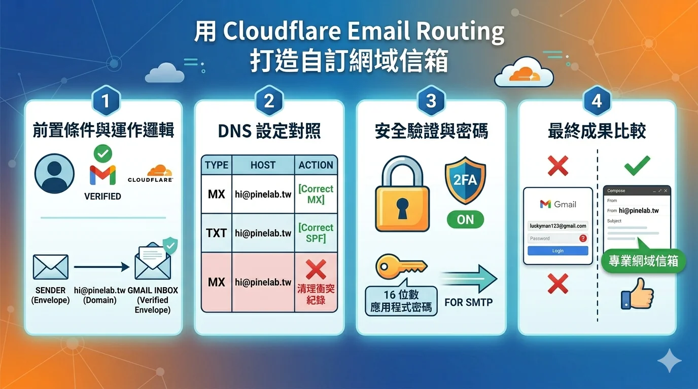

# 用 Cloudflare Email Routing 打造自訂網域信箱

想要擁有像 `hi@pinelab.tw` 這樣的專業信箱，又不想付費買 Google Workspace？這篇文章教你用 Cloudflare Email Routing 免費實現，並搭配 Gmail 收發信件。

## 前置條件

- 已將網域的 NS 設定為 Cloudflare（網域由 Cloudflare 托管）
- 擁有一個 Gmail 帳號作為實際收信信箱

---

## 第一步：設定 Cloudflare Email Routing

1. 登入 [Cloudflare Dashboard](https://dash.cloudflare.com)
2. 選擇你的網域
3. 左側選單點「**電子郵件**」→「**電子郵件路由**」
4. 點「**路由規則**」→「**建立位址**」

填入以下資訊：
- **自訂位址**：`hi`（系統會自動加上 `@pinelab.tw`）
- **動作**：傳送至電子郵件
- **目的地**：你的 Gmail 信箱（例如 `yourname@gmail.com`）

點「**儲存**」。

> ⚠️ 目的地信箱需要先驗證。Cloudflare 會寄一封驗證信到你的 Gmail，記得點擊確認連結。

---

## 第二步：刪除舊的 MX 記錄

如果你的網域之前由其他服務商管理（例如 Gandi），DNS 裡可能殘留舊的 MX 記錄。Cloudflare 會在設定頁面提示你刪除，照著刪除即可。

---

## 第三步：用 Gmail 以自訂網域寄信

Cloudflare Email Routing 只能**收信**，若想用 `hi@pinelab.tw` 回覆郵件，需要在 Gmail 設定 SMTP。

### 產生 Gmail 應用程式密碼

1. 前往 [myaccount.google.com/apppasswords](https://myaccount.google.com/apppasswords)
2. 應用程式名稱填 `pinelab mail`（任意名稱）
3. 點「建立」，複製產生的 16 位數密碼

> 注意：需要先開啟 Google 帳號的兩步驟驗證才能使用應用程式密碼。

### 在 Gmail 新增寄件地址

1. 開啟 Gmail，點右上角齒輪 →「**查看所有設定**」
2. 點「**帳戶和匯入**」
3. 在「選擇寄件地址」找到「**新增另一個電子郵件地址**」
4. 填入：
   - **名稱**：Pinelab（或你想顯示的名稱）
   - **電子郵件地址**：`hi@pinelab.tw`
5. 下一步，填入 SMTP 資訊：
   - **SMTP 伺服器**：`smtp.gmail.com`
   - **通訊埠**：`587`
   - **使用者名稱**：你的 Gmail 帳號
   - **密碼**：剛才產生的 16 位數應用程式密碼
   - 加密方式：**TLS**
6. 點「**新增帳戶**」

Gmail 會寄一封確認信到 `hi@pinelab.tw`，因為你已設定轉寄，這封信會出現在你的 Gmail 收件匣，點擊確認連結即完成。

---

## 完成！

設定完成後：

- 有人寄信到 `hi@pinelab.tw` → 自動轉寄到你的 Gmail
- 在 Gmail 撰寫新郵件時，點寄件人欄位可切換成 `hi@pinelab.tw` 寄出

這樣就擁有一個免費的專業網域信箱了 🎉

▲ 前置作業與運作邏輯、DNS 設定對照、安全驗證（2FA + 應用程式密碼）、最終收發信成果比較

